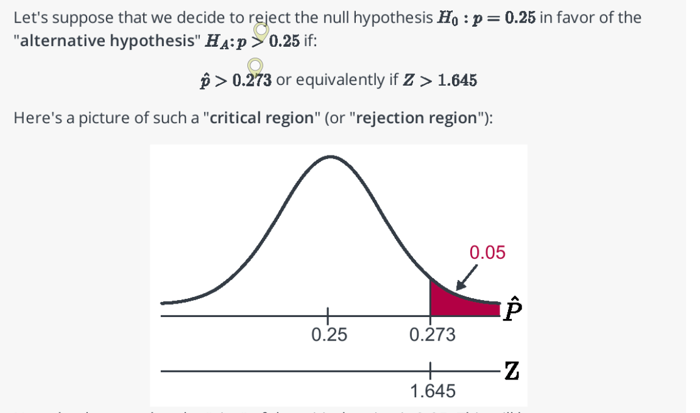
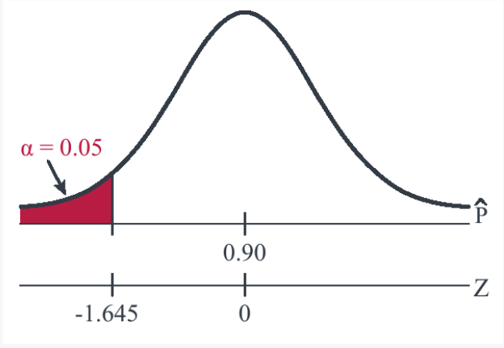

```{r setup, include=FALSE}
knitr::opts_chunk$set(echo = FALSE, message = FALSE, warning = FALSE)
```

# Reading Annotation Review / Q&A

-   Parameter of interest vs. point estimate/sample statistic
-   Process of Hypothesis test:
    -   Determine parameter of interest
    -   Determine appropriate point estimate
    -   Determine appropriate test statistic (standardized point estimate)
    -   Determine sampling distribution of test statistic
    -   Determine critical region and/or p-value threshold
    -   Compute test statistic (and possibly p-value)
    -   Compare test statistic to critical region (or p-value to $\alpha$)
    -   Make appropriate conclusion
-   How does $\alpha$ relate to the critical region?
-   How do we determine $H_A$? When should we choose one-sided vs. two-sided?
-   Where does $\hat{p} > 0.273$ come from below? The study found $\hat{p} = 0.29$



-   How do we choose a critical region?

-   What does "significance level" mean?

-   Is there a mathematical relationship between Type I and Type II error?

-   What type of error is worse?

-   If testing the hypothesis $p = 0.14$, could we instead construct a confidence interval and see if 0.14 falls in the interval?

-   Book statement: "P-value is the probability that we'd observe a more extreme statistic than we did if the null hypothesis were true"

    -   Student statement: *"I like this definition better. It makes more sense to me to think of p-values as a probability"*

-   *"This makes me wonder about how previous researchers have gotten data analysis and hypothesis testing wrong in their studies. I am in a research class at APU, and I am aware that researchers in my field are not always versed in statistics. I would like to hear more about common mistakes in hypothesis testing and how to avoid such issues."*

    -   "p-hacking"

    -   Mindlessly using defaults, not thinking about Type I / Type II error

    -   Equating statistical significance with practical significance

    -   Using hypothesis tests in contexts where no randomness was involved

-   How does using the variable \$D_i\$ get rid of the dependence between \$X_i\$ and \$Y_i\$ in paired data?

# Knowledge Check

*Knowledge Checks are to be used as study tools - especially as you prepare for exams (similar to the Exam Reviews provided in 361). Don't need to turn them in, but they're a way for you to check in on whether you are comprehending the main points of the reading. Any that you're unable to answer, you can ask specifically about in class and/or office hours.*

1.  What are the two possible conclusions from a hypothesis test?

<!-- + Reject $H_0$ or fail to reject $H_0$ -->

2.  Describe in words what a **null hypothesis** is. What notation do we use for it?

<!-- + It's the claim (about a population parameter) that we are trying to disprove. We use $H_0$ to denote the null hypothesis. -->

3.  Describe the difference between a population parameter and sample statistic. Which one is a hypothesis test about? Which one is observed?

<!-- + A population parameter is an unknown value (e.g. a mean $\mu$ or a proportion $\p$ in the population that we want to estimate. A sample statistic is the value computed from our sample data. The sample statistic is observed, a population parameter is unobserved. -->

4.  Describe in words what a **critical value** is and how it's used in a hypothesis test.

<!-- + A critical value is a cut-off value such that if our test statistic is more extreme than that value, we reject $H_0$, and if it is less extreme than that value, we fail to reject $H_0$.  -->

5.  Describe in words what a **test statistic** is and how it's used in a hypothesis test.

<!-- + A test statistic is a standardized version of -->

6.  Describe in words the two possible errors that can be made in a hypothesis test.

7.  Describe in words what a **significance level** is. What notation do we use for it?

8.  If $\alpha = 0.10$, what is the probability of making a Type I error?

9.  Draw a picture that illustrates what a p-value is. Make sure to include adequate labels for $\alpha$, the center of the distribution, and the critical value.

10. Describe how a p-value is used to define a critical/rejection region.

11. Describe how to use a p-value and an $\alpha$ level to make a decision about a hypothesis test.

12. Describe what each symbol in $Z = \frac{\hat{p} - p_0}{\sqrt{\frac{p_0(1-p_0)}{n}}}$ stands for.

13. What is the difference between $p$, $p_0$, and a p-value in the context of a hypothesis test about a proportion?

14. Articulate what's going on with the two x-axes in the following figure.

```{r}

```

15. Describe how $\alpha$ and Type I error are related.

16. Assume you're conducting a two-sided hypothesis test. What should you set your Z cutoff value to be if you want to:

    a)  control Type I error rate to be 0.10
    b)  control Type I error rate to be 0.05
    c)  control Type I error rate to be 0.01
