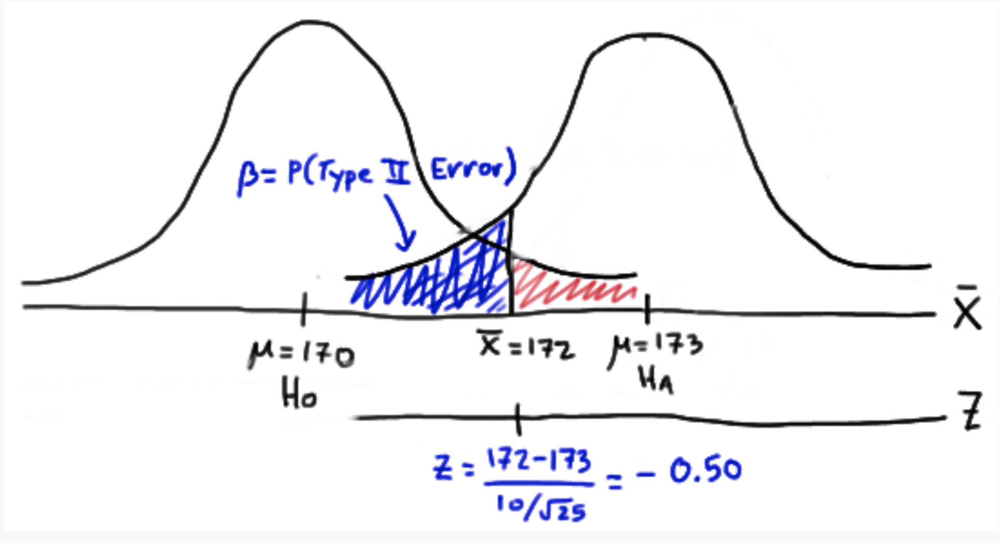
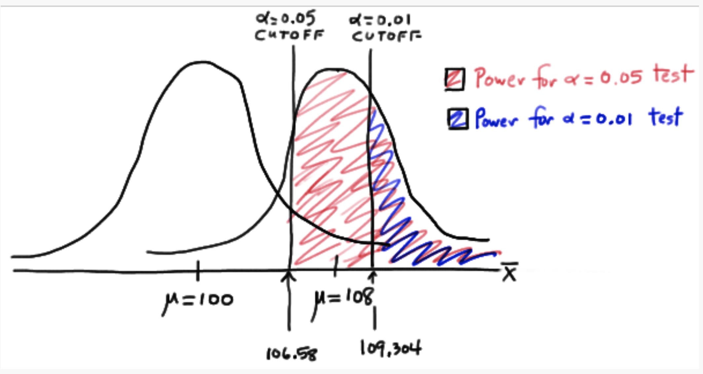

```{r setup, include=FALSE}
knitr::opts_chunk$set(echo = FALSE, message = FALSE, warning = FALSE)
```

1. What symbols do we use to represent Type I and Type II error?

2. Describe as best you can what's going on in the picture below

```{r}

```

3. If $\beta = 0.2$ for a given hypothesis test, what is the power of the test?

4. When designing a study, what are two main goals regarding Type I error and power?

5. Consider a hypothesis $H_0: \mu = 400$ vs $H_A: \mu > 400$. Will the power of this test be higher when the true parameter value is 437 or 407? Why? Draw a picture to illustrate. 

6. What happens to the power of a test as the true parameter moves farther away from the parameter hypothesized under the null hypothesis? 

7. Describe as best you can what's going on in the picture below. What happens to the power of a test if you change the $\alpha$ value? What does this tell you about the relationship between Type I and Type II error? 

```{r}

```

8. What happens to the power of a test as the sample size increases?
