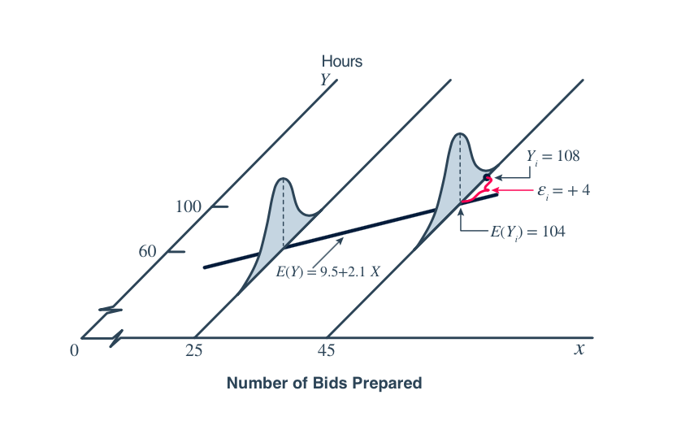

```{r setup, include=FALSE}
knitr::opts_chunk$set(message = FALSE, warning = FALSE)
```

## Student Questions

-   Why do we use $a_1$ and $b$ instead of $\beta_0$ and $\beta_1$ like in another class?
    + $\hat{y}_i = a_1 + bx_i$
-   Does Q stand for something, or is it just another variable name?
    + $Q = \sum_{i = 1}^n(y_i - \hat{y}_i)^2$
-   Why do we minimize the sum of the **squared** residuals? Instead of the residuals themselves?
-   What's the difference? Is this the point slope form? Why do we use it?

$$
\hat{y}_i = a + b(x_i - \overline{x})
$$

$$
\hat{y}_i = a_1 + bx_i
$$

-   $$ b = \frac{\sum_{i = 1}^n (x_i - \bar{x})(y_i - \bar{y})}{\sum_{i = 1}^n(x_i - \bar{x})^2}$$

    -   This reminds me of in 361 when we derived $b = r\frac{\sigma_y}{\sigma_x}$. Are these the same?
    
+ Where did our formulas for $a$ and $b$ come from?
    + $a = \bar{y}$

+ Connection to Linear Algebra - is this the same least squares method?

+ Where do the three parameters come from? How did they get the likelihood function? 
    + $L_{Y_i}(\alpha, \beta, \sigma^2) = \prod_{i = 1}^n\frac{1}{\sqrt{2\pi}\sigma}exp\left[-\frac{(Y_i - \alpha - \beta(x_i - \bar{x}))^2}{2\sigma^2}\right]$
    + $Y_i = \alpha + \beta(x_i - \bar{x}) + \epsilon_i, \ \ \epsilon_i \sim N(0,\sigma^2)$
+ $MSE = \frac{\sum_{i = 1}^n(Y_i - \hat{Y_i})^2}{n - 2}$. Why is it $n - 2$ and not $n - 1$? 
+ MSE is an unbiased estimator of $\sigma^2$, the common variance of the many populations. What does this "many" mean?

{width="554"}

+ What do they mean by hand-waving?
    + "the use of gestures and insubstantial language meant to impress or convince" - Oxford
+ If we are finding the confidence interval for $\alpha$, why do we not have $\alpha$ in these equations?
    + $a \pm t_{\alpha/2,n-2}\left(\sqrt{\frac{MSE}{n}}\right)$
    
## PS 08 - work on the board!

## Knowledge Check

-   What's the difference between an observed and a predicted value?
-   What is a residual? What notation and formula do we use for it?
-   What's the relevance of $Q = \sum_{i = 1}^n (y_i - \hat{y}_i)^2$ to least squares regression? Articulate the logic of least squares regression.
-   Explain as best you can what the following figure is demonstrating

{width="554"}

-   What are the four assumption of a linear regression model?

    -   L:

    -   I:

    -   N:

    -   E:

-   What's the point of writing the regression line as $\hat{y_i} = a + b(x_i - \bar{x})$ instead of $\hat{y_i} = a_1 + b(x_i - \bar{x})$?

-   What are the equations for the least squares estimators for the slope and intercept?

<!-- ## In Class Practice -->

<!-- -   Let $\hat{\beta} = \frac{\sum_{i = 1}^n (x_i - \bar{x})Y_i}{\sum_{i = 1}^n (x_i - \bar{x})^2}$, such that it is a linear combination of $n$ normal random variables $Y_i \sim N(\alpha + \beta(x_i - \bar{x}), \sigma^2)$. In groups, conduct a "down-the-line" proof of the following: $$E(\hat{\beta}) = \beta$$ $$V(\hat{\beta}) = \frac{\sigma^2}{\sum_{i = 1}^n (x_i - \bar{x})^2}$$ -->
