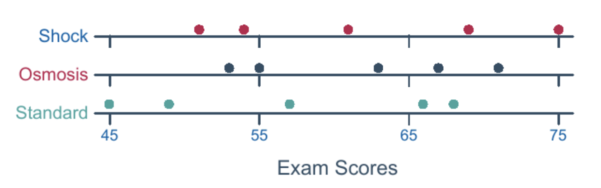

```{r setup, include=FALSE}
knitr::opts_chunk$set(message = FALSE, warning = FALSE)
```

## Student Questions

-   "ANOVA can be thought of as an extension of the pooled two-sample t-test"

    -   When it says extension do they mean you would be using both or can they be interchanged?

-   "We've been talking a lot about good plots and visualizations in this class and 250, and it bothers me that the colors don't align with the words on each line. It's confusing to tell which dots belong to which category. Do you compare them with the word or the color?"

-   

-   What does it mean for the researchers to be "blinded"? Is it just the act of renaming the brands? But that seems like it would add more confusion.

-   "I wonder: if we're going to assume that the different populations all have the same variance, are we really only just checking the variability between groups? Or do we need to estimate the variability within groups also so that we can compare it to the variability between groups?"

-   "I see in the example right above this that the larger F value of 93.44 resulted in a p value of 0.000, whereas the F values of 0.46 resulted in a large p value of 0.643 (if I am reading the tables correctly). You're saying that this F value is considered significant if it deviates from 1 since it is equal to the MST/MSE. Would the F distribution be centered around 1?"

-   Is the F-statistic the same as the test statistic?

-   Book: break down TOTAL variation into:

    1.  a component that is due to the TREATMENT (or FACTOR), and
    2.  a component that is due to just RANDOM ERROR

    -   Student: isn't #2 just be equal to the variance of each population as estimated by the samples from each?

-   Book: "Error means 'the variability within the groups" or "unexplained random error"

    -   Student: "Factor and error seem pretty similar. Does factor explain the variability while error defaults as random, unexplained variability?"

-   "What is m referring to in the degrees of freedom? Why do the degrees of freedom change between the categories of factor, error, and total?"

-   "Is the MSE related to the error sum of squares whose proof is provided below? If so, how does the MSB relate to the errors discussed below?"

-   Book: "We could have 5 measurements in one group, and 6 measurements in anotehr"

    -   Student: "Should we usually try to have similar measurements for groups though? Because I feel like if one group has a small number of measurements, and another group has a big number of measurements, then it might not be right to compare the mean of the two groups."

## Knowledge Check

-   What is the purpose of an ANOVA test?
-   What are the assumptions in an ANOVA test?
-   What is the null hypothesis in an ANOVA test? What is the alternative?
-   ANOVA splits variation into what two components?
-   What is meant by $SS(Total) = SS(Between) + SS(Error)$?
-   What do Source, DF, SS, MS, F, and P stand for in an ANOVA table?
-   How is the F-statistic calculated?
-   Hos is the F-statistic distributed? How many degrees of freedom does it have?
-   How are MSB and MSE calculated? What do the letters stand for?
-   What does $\overline{X}_{i\cdot}$ stand for? What about $\overline{X}_{\cdot\cdot}$
