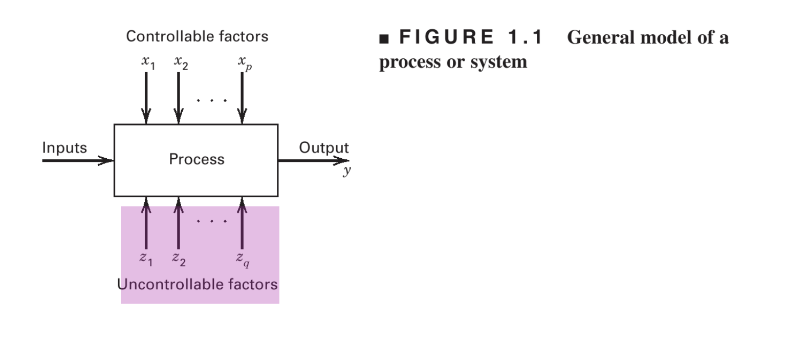
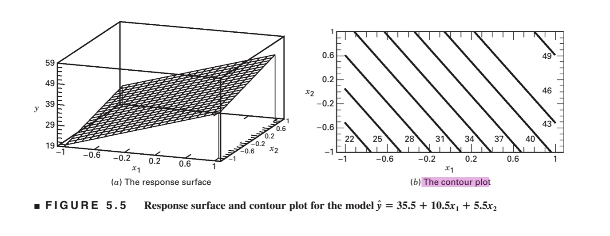

```{r setup, include=FALSE}
knitr::opts_chunk$set(message = FALSE, warning = FALSE)
```

## Student Questions

-   "In the ANOVA test this is the error, right? Since we group anything not the factors we are looking at as the error?"



<br/> <br/>

-   Book: "Obviously many other factors could be considered, but let's assume that these are the ones of primary interest. Furthermore, based on long experience with the game, I decide that factors 5 through 8 can be ignored; that is, these factors are not important because their effects are so small that they have no practical value. Engineers, scientists, and business analysts often must make these decisions about some of the factors they are considering for real experiments."

    -   Student: "This would be a part of the process before experimentation. This is where people could conduct literature reviews to decipher which factors are the most important for analysis, or have the largest impact on the response variable. Literature reviews are also helpful in identifying gaps in the current knowledge of a field or specific topic. This knowledge could supplement the best-guess approach." <br/> <br/>

-   "I think that this is really the key word here; we have to come to answer these questions BEFORE we begin our experiment to make sure that the results are truly"objective." (however, it is important to note that results may differ if different researchers answer these questions differently, so in that sense the experimental design itself is subjective, but the point is that the same experimental design performed by different researchers should on average yield similar results, which is what I mean by objective--but anyways, I digress). Some of these questions may be harder to answer before performing the experiment than others. I would imagine it would be difficult for researchers to go into an experiment with a complete understanding of all possible confounding variables, so in some sense our understanding of such things can and often does change as we perform experiments (which I believe is the super basic idea of the Bayesian model of statistics... someone correct me if I'm wrong). However, it would truly be dangerous if we decide on how we answer these questions AFTER getting our data since it would seem that with all the data in front of us, we can artificially pick an experimental design intentionally to reject or fail to reject certain conclusions; I can only think back to p-hacking." <br/> <br/>

-   Book: "One-Factor-at-a-time (OFAT) method consists of selecting a starting point, or **baseline** set of levels, for each factor, and then successively varying each factor over its range with the other factors held constant at the baseline level."

    -   Student: "Is this like the dummy variables that R creates for things?" <br/> <br/>

-   Is a factorial experiment kind of like fitting an interaction model like we saw in MATH 250? <br/> <br/>

-   Book example: author playing golf, type of driver (2) and type of ball (2) are factors of interest. $2^2 = 4$ combinations. He plays two rounds at each of the 4 combinations, for a total of 8 rounds.

    -   Student "If this was conducted with just him playing eight rounds of golf, would this be considered a paired test?" <br/> <br/>

-   What's the point of running replicates?

    -   Check out what it does to the test statistic: [seeing-theory](https://seeing-theory.brown.edu/probability-distributions/index.html#section2) <br/> <br/>

-   Book: we could extend this concept to three factors

    -   Student: "I could imagine that this would get really complicated really quickly, which in real-world experimentation may not always be easy to avoid; however, will we always have to do the math by hand? I would imagine not (since this reminds me a lot of the interaction vs main effects model in R) but just a thought." <br/> <br/>

-   "How would the fractional factorial experiment compare mathematically to the typical 2\^4 (or more generally 2\^n) factorial design?"

    -   See Chapter 8 [here](%5Bhttps://www.researchgate.net/profile/Farshad-Fattahi/post/Need-the-procedure-for-critical-limit-fixation/attachment/59d6459179197b80779a0aa7/AS%3A453901993418752%401485230076186/download/Douglas-C.-Montgomery-Design-and-Analysis-of-Experiments-Wiley-2012.pdf%5D(https://www.google.com/url?sa=i&rct=j&q=&esrc=s&source=web&cd=&cad=rja&uact=8&ved=0CAQQw7AJahcKEwiQsZbAup37AhUAAAAAHQAAAAAQAg&url=https%3A%2F%2Fwww.researchgate.net%2Fprofile%2FFarshad-Fattahi%2Fpost%2FNeed-the-procedure-for-critical-limit-fixation%2Fattachment%2F59d6459179197b80779a0aa7%2FAS%253A453901993418752%25401485230076186%2Fdownload%2FDouglas-C.-Montgomery-Design-and-Analysis-of-Experiments-Wiley-2012.pdf&psig=AOvVaw1V2eAYPZW7vENgrbDWbLrc&ust=1667957850960113))

    -   Basically comes down to determining which high-order interaction effects you're okay with being "masked" <br/> <br/>

-   Book: "Interaction effect is small and can be ignored"

    -   Student: "Is this kind of like the idea of Occam's razor we saw in Data Analysis. Since the interaction effect is relatively small compared to the main effects we can ignore it to make our model simpler, since the interaction does not help explain much of our data? Because technically, it would seem that the equation involving the interaction is more accurate strictly speaking, though it is a lot more complicated and does not seem to add too much information." <br/> <br/>

-   "This contour plot seems to suggest that there are several ways of achieving the same result. For example, I am thinking of an experiment in which the researchers want to know what values of x1 and x2 will produce a y value of, say 40. Based on the model and the contour plot, it seems that there are many combinations of x1 and x2 that are expected to yield that result so do they just choose a point on that line or are there other factors at play? I am imagining that since we have a linear equation in multiple variables, we would get infinitely many solutions for any specific result as more factors are added. I am also wondering if any issues of extrapolation can come into play. The researchers can only test so many values of x1 and x2, so if their desired result is not within those values, can they still use this model to predict it an appropriate combination of x1 and x2, or would this be too much extrapolation?"

     <br/> <br/>

-   "For our Exam 2 will we need to be able to do an ANOVA test for the two-factor factorial or will we be focusing on how we did the ANOVA test on last week's Problem Set?" <br/> <br/>

-   "I wonder based on the different possible values of the F-statistic can we reject some of the null hypotheses above while failing to reject others. For example, if the F-statistic for both the A and B treatments are high, but the F-statistic for their interaction is approximately 1, would that mean that we conclude that the different factors affect the mean of the output; however, there is no interaction between them?" <br/> <br/>

-   $F_{0.05,4,27} = 2.73$ Where did this number come from? I don't see it in the table?
