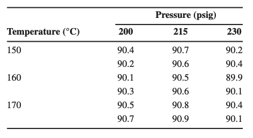
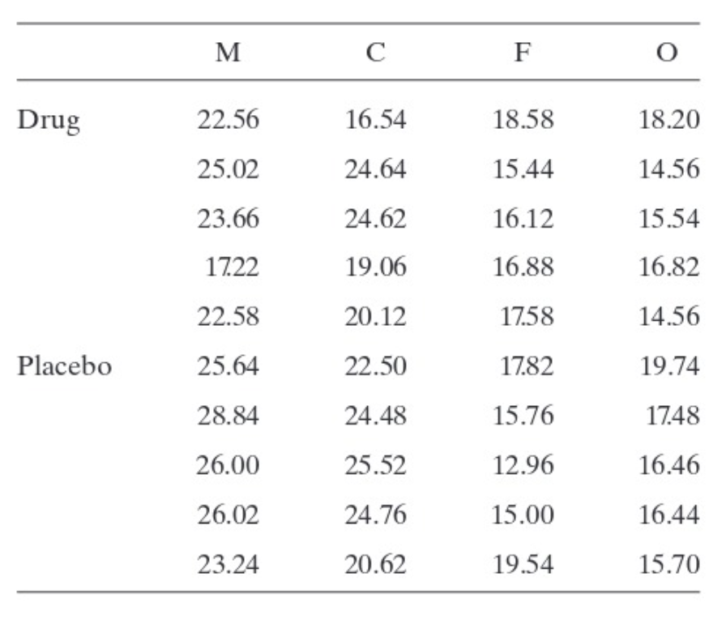

```{r setup, include=FALSE}
knitr::opts_chunk$set(echo = TRUE, message = FALSE, warning = FALSE)
```

```{r}
library(tidyverse)
library(broom)
```

# Learning objectives

+ Derive the expected value for sums of squares in a two-way ANOVA model
+ Understand relationships between degrees of freedom, sums of squares, mean squares, F-statistics, and p-values in an ANOVA table
+ Conduct ANOVA tests in R

# Exercises

## By hand or typed

### Exercise 1

Recall the two-factor interaction model given by $$y_{ijk} = \mu + \tau_i + \beta_j + (\tau\beta)_{ij} + \epsilon_{ijk},$$

where:

-   $i = 1, 2, \dots, a$
-   $j = 1, 2, \dots b$
-   $k = 1, 2, \dots n$
-   $\mu$ is the overall mean effect
-   $\tau_i$ is the effect of the $i$th level of factor A
-   $\beta_j$ is the effect of the $j$th level of factor B
-   $(\tau\beta)_{ij}$ is the effect of the interaction betweeen $\tau_i$ and $\beta_j$
-   $\epsilon_{ijk} \sim N(0, \sigma^2)$ is the random error term

#### Part a

Recall that $SSA = bn\sum_{i = 1}^a(\overline{y}_{i\cdot\cdot} - \overline{y}_{\cdot\cdot\cdot})^2 = \frac{1}{bn}\sum_{i = 1}^ay_{i\cdot\cdot}^2 - \frac{y_{\cdot\cdot\cdot}^2}{abn}$. Show that $E(SSA) = \sigma^2(a-1) + bn\sum_{i = 1}^a\tau_i^2$. You may use the following definitions/facts in your proof:

-   $\sum_{i = 1}^a\tau_i = 0$
-   $\sum_{j = 1}^b\beta_i = 0$
-   $\sum_{i = 1}^a(\tau\beta)_{ij} = \sum_{j = 1}^b(\tau\beta)_{ij} = 0$
-   $y_{i\cdot\cdot} = \sum_{j = 1}^b\sum_{k = 1}^ny_{ijk}$
-   $y_{\cdot\cdot\cdot} = \sum_{i = 1}^a\sum_{j = 1}^b\sum_{k = 1}^ny_{ijk}$

#### Part b

Use your results from (a) to show that $E(MSA) = \sigma^2 + \frac{bn}{a-1}\sum_{i = 1}^a\tau_i^2$

#### Part c

Articulate why $F = \frac{MSA}{MSE}$ is a good test statistic to test $H_0: \tau_1 = \tau_2 = \cdots = \tau_a = 0$.

### Exercise 2

The following output was obtained from a computer program that performed a two-factor ANOVA on a factorial experiment.

| Source      | DF                 | SS                 | MS                 | F                  | p-value            |
|------------|------------|------------|------------|------------|------------|
| A           | 1                  | 0.322              | \_\_\_\_\_\_\_\_\_ | \_\_\_\_\_\_\_\_\_ | \_\_\_\_\_\_\_\_\_ |
| B           | \_\_\_\_\_\_\_\_\_ | 80.554             | 40.2771            | 4.59               | \_\_\_\_\_\_\_\_\_ |
| Interaction | \_\_\_\_\_\_\_\_\_ | \_\_\_\_\_\_\_\_\_ | \_\_\_\_\_\_\_\_\_ | \_\_\_\_\_\_\_\_\_ | \_\_\_\_\_\_\_\_\_ |
| Error       | 12                 | 105.327            | 8.7773             |                    |                    |
| Total       | 17                 | 231.551            |                    |                    |                    |

: Two-way ANOVA: y versus A,B

a)  Fill in the blanks in the ANOVA table.
b)  How many levels were used for factor B?
c)  How many replicates of the experiment were performed?
d)  Write out the 3 sets of hypotheses that were tested in this analysis
e)  What conclusions would you draw about this experiment?

## Typed

### Exercise 3

The yield of a chemical process is being studied. The two most important variables are thought to be the pressure and the temperature. Three levels of each factor are selected, and a factorial experiment with two replicates is performed. The yield data are as follows:



The following code places the above data in a dataframe to be analyzed.

```{r}
data <- data.frame(y = c(90.4, 90.7, 90.2,
                         90.2, 90.6, 90.4,
                         90.1, 90.5, 89.9,
                         90.3, 90.6, 90.1,
                         90.5, 90.8, 90.4,
                         90.7, 90.9, 90.1),
                   temp = c(rep(150, 6),
                            rep(160, 6),
                            rep(170, 6)),
                   pressure = c(rep(c(200, 215, 230), 6)))

data <- data %>% 
  mutate(temp = factor(temp),
         pressure = factor(pressure))
```

a.  Create a faceted side-by-side boxplot of the data
b.  Conduct a two-way ANOVA using `aov()`. You can view the full ANOVA table results using `tidy()` around the `aov()` object.
c.  Find the appropriate critical values that the statistics in the `statistic` column should be compared to. Assume $\alpha = 0.01$.
d.  What conclusions should be drawn from this experiment?
e. Suppose a high yield of the chemical is desirable. What combination of factors would you recommend based on this experiment? Or is there not enough conclusive evidence to make a recommendation? 

```{r, echo = FALSE, eval = FALSE}
tidy(aov(y ~ temp + pressure + temp*pressure, data = data))

ggplot(data, aes(x = temp, y = y)) +
  facet_wrap(~ pressure) +
  geom_boxplot()

ggplot(data, aes(x = pressure, y = y)) +
  facet_wrap(~ temp) +
  geom_boxplot()
```

### Exercise 4

A psychology student was interested in testing how food consumption by rats would be affected by a particular drug. She used two levels of one attribute, namely, drug and placebo, and four levels of a second attribute, nameley, male (M), castrated (C), female (F), and ovariectomized (O). For each cell, she observed 5 rats. The amount of food consumed in grams per 24 hours is listed in the following table:



```{r}
rat_data <- data.frame(y = c(22.56, 16.54, 18.58, 18.20,
                             25.02, 24.64, 15.44, 14.56,
                             23.66, 24.62, 16.12, 15.54,
                             17.22, 19.06, 16.88, 16.82,
                             22.58, 20.12, 17.58, 14.56,
                             25.64, 22.50, 17.82, 19.74,
                             28.84, 24.48, 15.76, 17.48,
                             26.00, 25.52, 12.96, 16.46,
                             26.02, 24.76, 15.00, 16.44,
                             23.24, 20.62, 19.54, 15.70),
                       A =factor(c(rep("drug", 20),
                                rep("placebo", 20))),
                       B = factor(c(rep(c("M", "C", "F", "O"), 10)))
)
```

For (a) - (c), report the relevant test statistic & critical value. State your conclusion in the context of the problem. 

a. Use a 5% significance level to test $H_0: \gamma_{ij} = 0, i = 1,2, j = 1,2,3,4$
b. Use a 5% significance level to test $H_0: \alpha_1 = \alpha_2  = 0$
c. Use a 5% significance level to test $H_0: \beta_1 = \beta_2  = \beta_3 = \beta_4 = 0$
d. Provide an appropriate visualization of these data. Think critically about which comparison is of primary interest, and use data viz best practices to group in space accordingly. Comment on any additional insight the visualization offers to the analysis. 

```{r, echo = FALSE, eval = FALSE}
tidy(aov(y ~ A*B, data = rat_data))

ggplot(rat_data, aes(y = y, x = A)) +
  facet_wrap(~B) +
  geom_boxplot()

rat_data %>% 
  group_by(B, A) %>% 
  summarize(mean = mean(y))
```


```{r, echo = FALSE, eval = FALSE}
data_long_scored <- data_long_scored %>% 
  mutate(viz_ID = factor(viz_ID),
         delta = factor(delta),
         sig = factor(sig),
         ExCond = factor(ExCond),
         ResponseId = factor(ResponseId))
tidy(aov(score7 ~ ResponseId + viz_ID*delta*sig, data = data_long_scored  %>% 
  filter(researcher != 1)))

data_long_scored %>% 
  filter(researcher == 0) %>% 
  ggplot(aes(y = score7, x = viz_ID)) +
  facet_wrap(~ExCond) +
  geom_boxplot()

data_long_scored %>% 
  filter(researcher == 0) %>% 
  ggplot(aes(x = score7, y = viz_ID)) +
  facet_wrap(~ExCond) +
  geom_density_ridges()
```

## Submission

Once you have completed all Exercises and written up your results in the Template .Rmd provided, take about 5-10 minutes to respond to the reflection prompts (RP) at the top of the Template:

-   (RP1): *What were the main concepts covered in this assignment?*

-   (RP2): *What's one thing you understand better after completing these problems?*

-   (RP3): *What problems gave you the most trouble? What was difficult about them/where did you get stuck?*

Knit your document one final time, then upload your .html file to Problem Set 09 on Canvas.

## Grading (50pts)

| Component            | Points |
|:---------------------|:-------|
| RP1                  | 5      |
| RP2                  | 5      |
| RP3                  | 5      |
| Formatting & Clarity | 5      |
| Exercise completion  | 30     |
