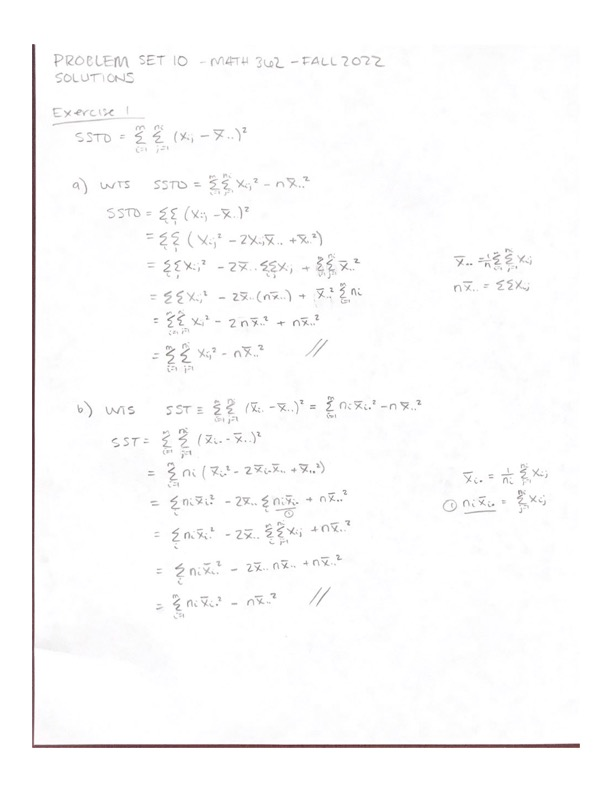
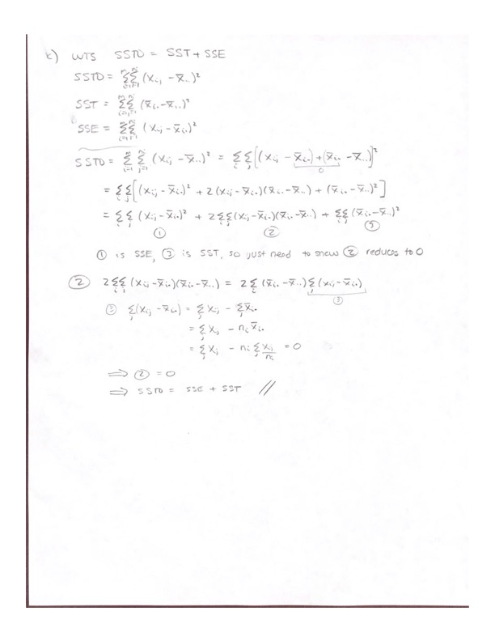
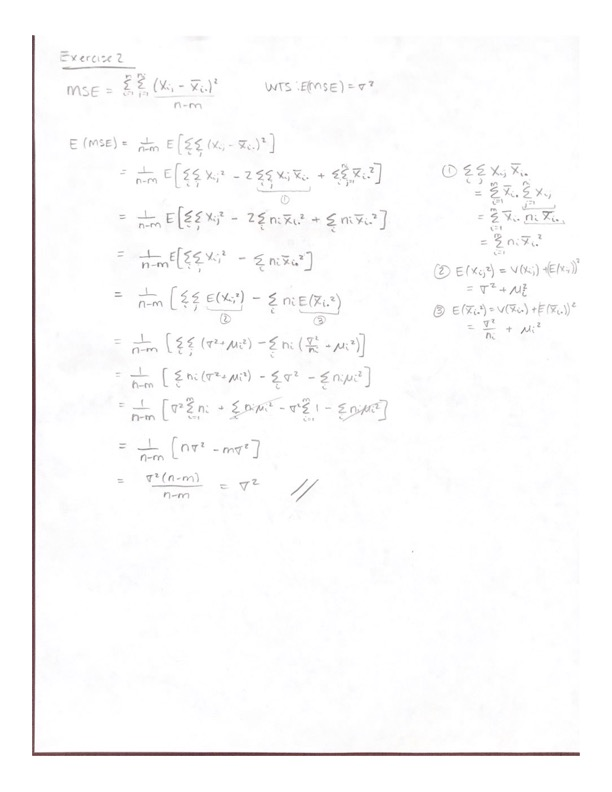
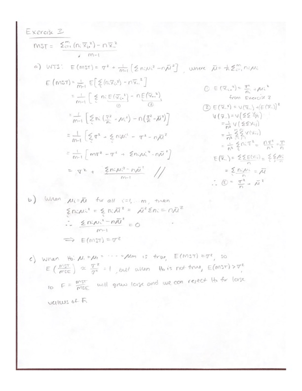

```{r setup, include=FALSE}
knitr::opts_chunk$set(message = FALSE, warning = FALSE)
```

You can access the .Rmd for the solutions [here](https://github.com/kgfitzgerald/APU_MATH_362/blob/main/PROBLEM_SETS/SOLUTIONS/PS-10-SOLUTIONS.Rmd).

```{r, message = FALSE, warning = FALSE}
library(tidyverse)
library(broom)
library(kableExtra)
```

## Summary / Reflection Prompts

*RP1: What were the main concepts covered in this assignment?*

*RP2: What's one thing you understand better after completing these problems?*

*RP3: What problems gave you the most trouble? What was difficult about them/where did you get stuck?*

# By hand or typed

## Exercise 1





## Exercise 2



## Exercise 3



# Typed

## Exercise 4

```{r}
hedge_sparrow <- c(22.0, 23.9, 20.9, 23.8, 25.0,
                   24.0, 21.7, 23.8, 22.8, 23.1,
                   23.1, 23.5, 23.0, 23.0)

robin <- c(21.8, 23.0, 23.3, 22.4, 23.0,
           23.0, 23.0, 22.4, 23.9, 22.3,
           22.0, 22.6, 22.0, 22.1, 21.1,
           23.0)

wren <- c(19.8, 22.1, 21.5, 20.9, 22.0, 
          21.0, 22.3, 21.0, 20.3, 20.9,
          22.0, 20.0, 20.8, 21.2, 21.0)

data <- data.frame(x_ij = c(hedge_sparrow, robin, wren),
                   species = c(rep("Hedge sparrow", length(hedge_sparrow)),
                               rep("Robin", length(robin)),
                               rep("Wren", length(wren))))
```

### Part a

```{r}
ggplot(data, aes(x = species, y = x_ij)) +
  geom_boxplot()
```

### Part b

```{r}
xbar_dotdot <- mean(data$x_ij)
n <- dim(data)[1]
m <- 3

summary <- data %>% 
  group_by(species) %>% 
  mutate(xbar_i = mean(x_ij)) %>% 
  ungroup() %>% 
  summarize(SST = sum((xbar_i - xbar_dotdot)^2),
            SSE = sum((x_ij - xbar_i)^2)) %>% 
  mutate(df1 = m - 1,
         df2 = n - m, MST = SST/df1,
         MSE = SSE/df2,
         F = MST / MSE,
         p_value = pf(F, df1, df2, lower.tail = FALSE))
summary %>% 
  kbl() %>% 
  kable_minimal()
```

| Source  | df  | SS  | MS  | F   | p-value |
|---------|:----|:----|:----|:----|:--------|
| species | `r summary$df1`    | `r summary$SST`    |  `r summary$MST`   | `r summary$F`    |   `r summary$p_value`      |
| Error   | `r summary$df2`     | `r summary$SSE`    |  `r summary$MSE`   | NA  | NA      |
| Total   | `r summary$df1 + summary$df2`     |  `r summary$SST + summary$SSE`   | NA  | NA  | NA      |

### Part c

$$H_0: \mu_1 = \mu_2 = \mu_3$$
$$H_A: \text{ at least one } \mu_i \neq \mu_j \text{ for } i\neq j$$
$$F = \frac{MST}{MSE} = \frac{`r summary$MST`}{`r summary$MSE`} = `r summary$F`$$
$F \sim F_{(m-1,n-m)}$, so an appropriate critical region is given by the code below.

```{r}
crit <- qf(.99, m-1, n-m)
crit
```

Since $F > `r crit`$, we reject $H_0$. There is sufficient evidence to claim the means are not all equal; species does affect the size of the eggs.

### Part d

```{r}
tidy(aov(x_ij ~ species, data = data)) %>% 
  kbl() %>% 
  kable_minimal()
```

## Exercise 5

```{r}
data_ex5 <- data.frame(perc_cotton = c(rep(15, 5),
                                   rep(20, 5),
                                   rep(25, 5),
                                   rep(30, 5),
                                   rep(35, 5)),
                   tensile_strength = c(7, 7, 15, 11, 9,
                                        12, 17, 12, 18, 18,
                                        14, 18, 18, 19, 19,
                                        19, 25, 22, 19, 23,
                                        7, 10, 11, 15, 11))

tidy(aov(tensile_strength ~ perc_cotton, data_ex5)) %>% 
  kbl() %>% 
  kable_minimal()

ggplot(data_ex5, aes(x = factor(perc_cotton), y = tensile_strength)) +
  geom_boxplot() +
  theme_minimal() +
  labs(y = "Tensile strength",
       x = "% Cotton")
```

There is not sufficient evidence to conclude that strengths of a synthetic fiber differ by percentage of cotton in the fiber. 